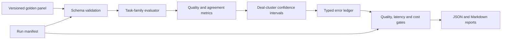

# System design and evidence index

## Evaluation lifecycle



Every report is bound to dataset, rubric, prompt, schema, provider/model, code revision and
pricing identifiers. Invalid or missing outputs remain in the denominator.

## Evidence index

| Evaluation property | Repository artifact | Verification |
|---|---|---|
| Four task families | [`evaluate.py`](../src/conv_eval/evaluate.py) | QA, summary, analytics and violation adapters are scored separately |
| Strict output contracts | [`schema.py`](../src/conv_eval/schema.py) | invalid fields and uncontrolled states fail validation |
| Agreement methodology | [`METHODOLOGY.md`](../METHODOLOGY.md) | decision-unit denominator and human adjudication are defined explicitly |
| Uncertainty | [`metrics.py`](../src/conv_eval/metrics.py) | percentile intervals resample complete deals |
| Error analysis | [`ERROR_TAXONOMY.md`](../ERROR_TAXONOMY.md) | each mismatch is assigned a stable typed code |
| Release protection | [`regression_gates.demo.json`](../configs/regression_gates.demo.json) | absolute and baseline-relative rules fail closed |
| Reproducibility | [`tests/`](../tests/) | unit and integration tests cover scoring, schemas and gates |

## Agreement measurement contract

For a frozen 500-deal golden panel:

```text
agreement = matching model and adjudicated-gold decision states
            divided by all evaluated decision states
```

The deal count defines the sampled population. The decision-state count is the metric
denominator. Agreement is paired with critical-violation recall, weighted-score error, schema
validity and a deal-cluster 95% confidence interval.

## Reproduce the release surface

```bash
python -m unittest discover -s tests -v
PYTHONPATH=src python -m conv_eval generate --out fixtures/generated --deals-per-family 500
PYTHONPATH=src python -m conv_eval evaluate \
  --gold fixtures/generated/golden.jsonl \
  --predictions fixtures/generated/predictions.candidate.jsonl \
  --manifest fixtures/generated/run.candidate.json \
  --json-out reports/generated/candidate.json \
  --markdown-out reports/generated/candidate.md \
  --bootstrap 1000
```

The workflow is deterministic and does not require a model API.
